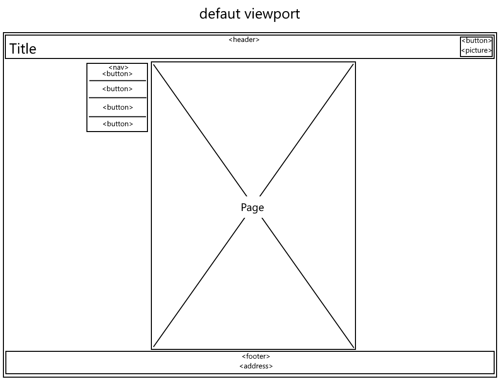
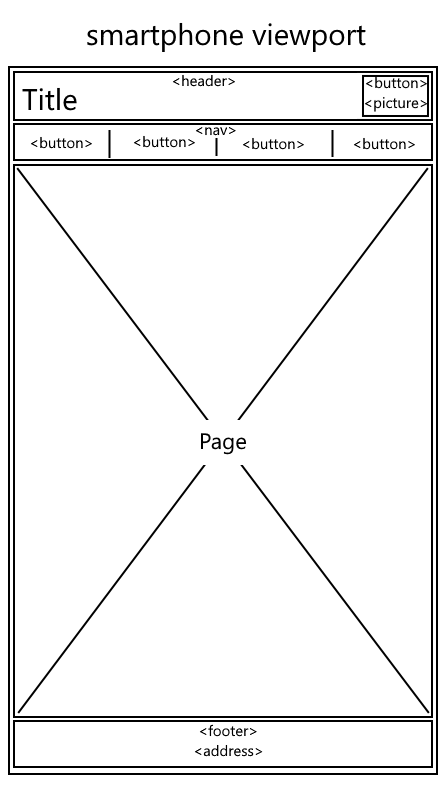
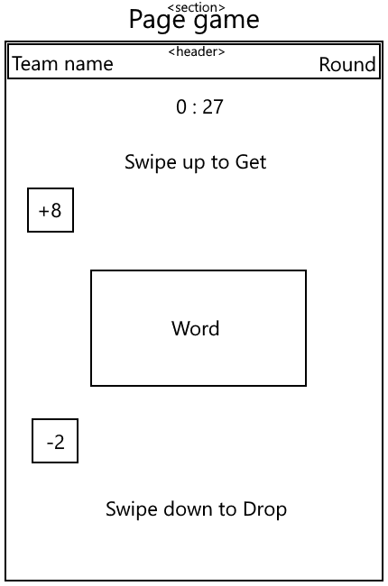
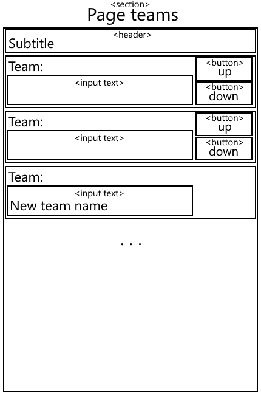
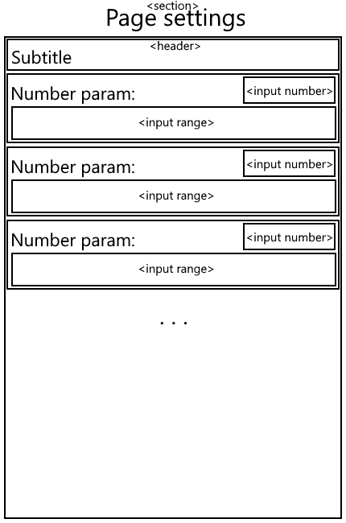
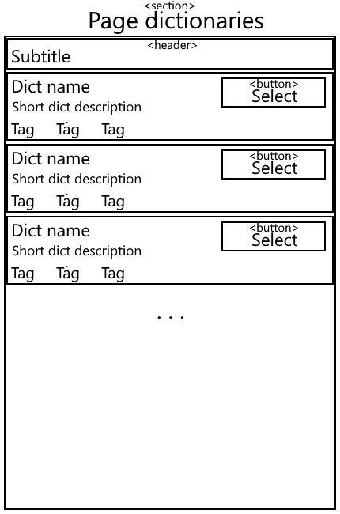

Alias game
==========

Репозиторий предназначен для сдачи лабораторных работ по предмету ИТиРОД.

**Тема:** 'Alias' game.

**Выполнил:** Хрол Константин Александрович, группа 953503.

**Функциональность**, согласно условию:
* Выбор набора слов
* Указание количества команд и их названий
* Настройка количества раундов, времени на раунд, очков за укадывание и пропуск слова
* Во время раунда карточки со словами двигаются мышкой
* После каждого раунда появляется таблица результатов, в которой можно изменить состояние слов

Wireframes
----------

Основной вид приложения:

Вместо **Page** подставляется одна из текущих страниц:

